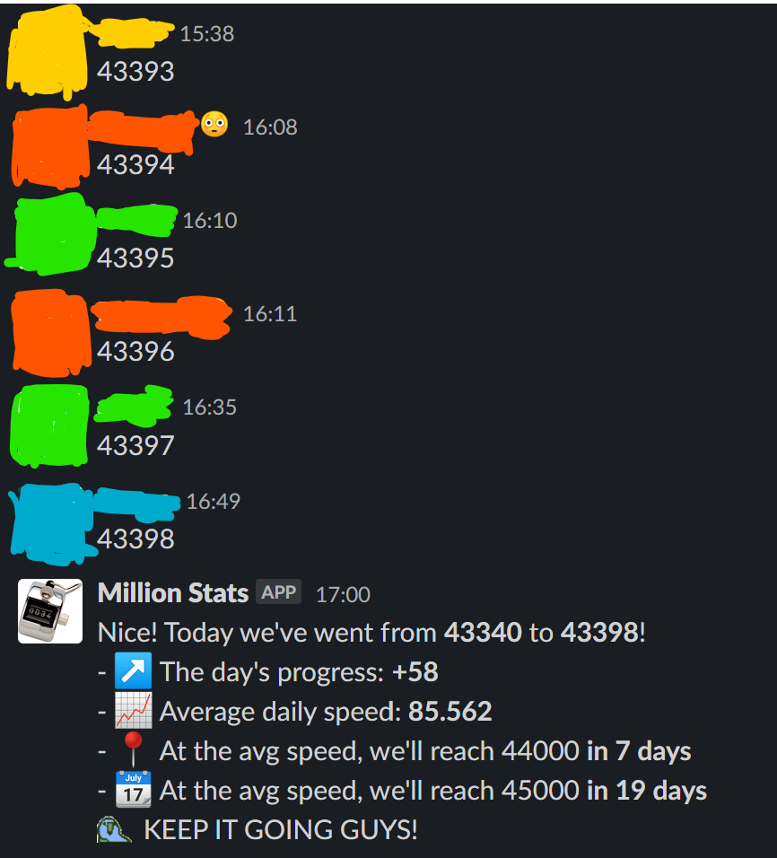

# Million Stats

This is an app for the #counttoamillion channel in Hack Club's Slack workspace, where you and a team of other cool kids together try to count to a million, base ten, by ones. No one can count consecutively. No purpose, just a fun team-building game :)

Every midnight, the bot gives a report on the progress the channel's made and the average daily speed:

## Modifying this thing

- `app.js` contains the primary Bolt app. It imports the Bolt package (`@slack/bolt`) and starts the Bolt app's server.
- `.env` is where you'll put your [Slack app's authorization token and signing secret](https://slack.dev/bolt-js/tutorial/getting-started#tokens-and-installing-apps) and your [Airtable API key](https://support.airtable.com/hc/en-us/articles/219046777-How-do-I-get-my-API-key-).

## Packages used

- [moment.js](https://momentjs.com/)
- [node-schedule](https://www.npmjs.com/package/node-schedule)
- [Slack's Bolt API](https://slack.dev/bolt-js/tutorial/getting-started)
- [Airtable](https://airtable.com/api)

\ ゜ o ゜)ノ
